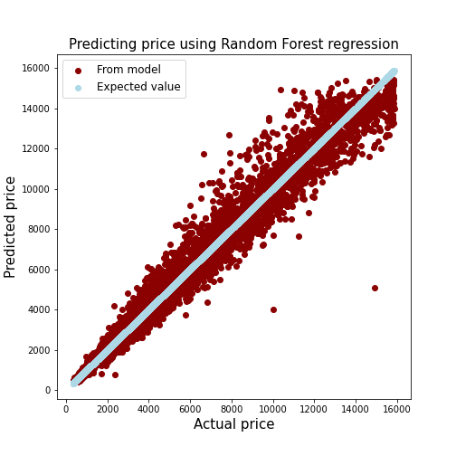

# About this project
In this project I am exploring the diamond dataset provided from [Kaggle.](https://www.kaggle.com/shivam2503/diamonds)

First I cleaned up the data to remove any 0-valued numbers and removed outliers using the `stats.zscore` calculation. This simply removed data points that were outside of the 3 standard deviation threshold that I gave it. 

Then, because three of the columns were of 'object' type, I used `LabelEncoder` to translate the categorical data into numbers so I could use this information for fitting. 

After cleaning up the data, I was able to predict the price of a diamond with 98 % accuracy using an Ensemble Regressor model called `RandomForestRegressor`. A plot to show the actual price vs predicted price from the model can be seen below:

